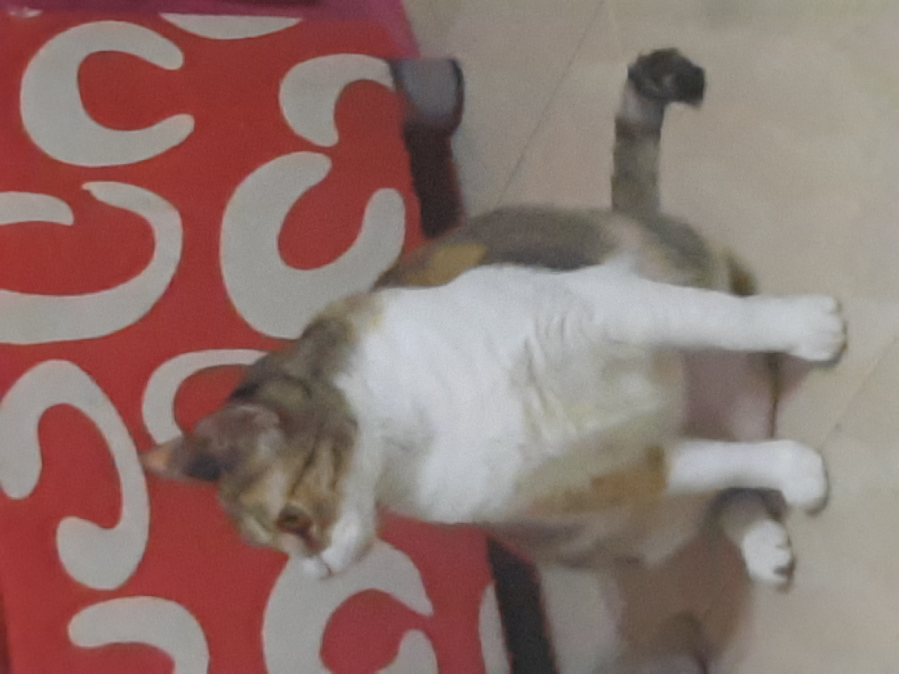
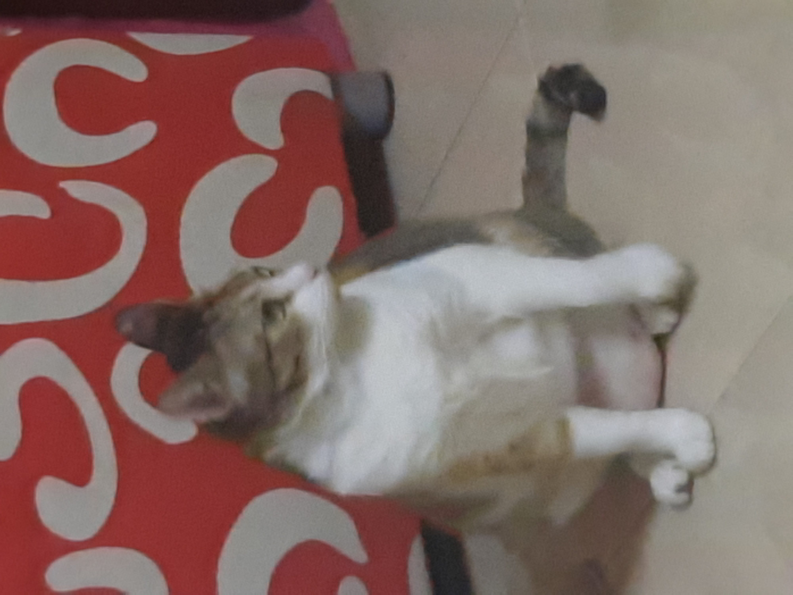
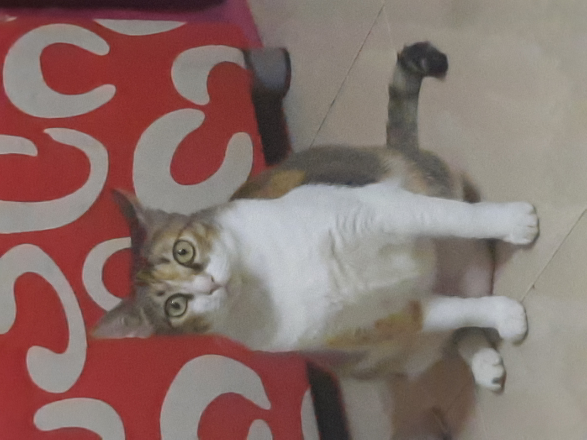

# Mochi Mic Test
Welcome to my cat's mic test session, where you can use this website to test your webcam mic or just make fun of this website.

# How to you use this?
* Make sure that the microphone permission has been granted by your browser
* Then start screaming until the cat is watching you.
* You can try to record as many as you want to check if your mic has good quality audio
* If the cat does not react, try to calibrate it in decibels (dB)

# What picture will show if my mic is loud?
#### Well... Try to hover these pictures
 

### If you want to have some suggestions or bug report, contact reyesgavinjarred@gmail.com
